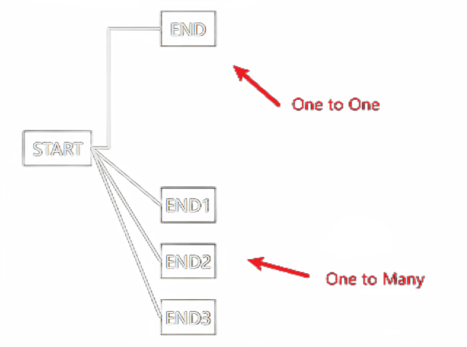

# A Very Simple Leader Line Component of Vue2

> WIP.

## Features

- [x] Vertical Leader Line
- [ ] Horizontal Leader Line
- [x] One to One
- [x] One to Many



## Usage

```html
<template>
  <div id="app">
    <div class="end" ref="end">END</div>

    <div class="start" ref="start">START</div>

    <div class="end" ref="end2">END1</div>
    <div class="end" ref="end3">END2</div>
    <div class="end" ref="end4">END3</div>

    <leader-line constraint align="start" :padding="[16]" ref="z" />

    <leader-line :constraint="false" ref="z1" />
  </div>
</template>

<script>
  import LeaderLine from "./";

  export default {
    name: "App",
    components: {
      LeaderLine,
    },
    mounted() {
      // one to one
      this.$refs.z.binds(this.$refs.start, this.$refs.end);

      // one to many
      this.$refs.z1.binds(this.$refs.start, [
        this.$refs.end2,
        this.$refs.end3,
        this.$refs.end4,
      ]);
    },
  };
</script>

<style>
  .start,
  .end {
    border: 1px solid #000;
    height: 2em;
    justify-content: center;
    align-items: center;
    display: flex;
  }
  .start {
    width: 4em;
    margin-top: 80px;
    margin-left: 30px;
  }
  .end {
    width: 3.2em;
    margin-top: 20px;
    margin-left: 160px;
  }
</style>
```

## Props

```ts
interface Props {
  // default: "currentColor"
  color: string;

  // default: 2
  thickness: number;

  // If true, the line will be constrained to the two ends of vertical line.
  // default: true
  constraint: boolean;

  // default: [0, 0]
  padding: [number, number];

  // default: "center"
  align: "start" | "end" | "center";
}
```

## Methods

```ts
interface Methods {
  // if EndRef is an array, draw multiple lines
  binds(StartRef: HTMLElement, EndRef: HTMLElement | HTMLElement[]): void;
}
```

## Development

```sh
# build lib
npm run build:lib

# serve demo and access http://localhost:8080
npm run serve
```
